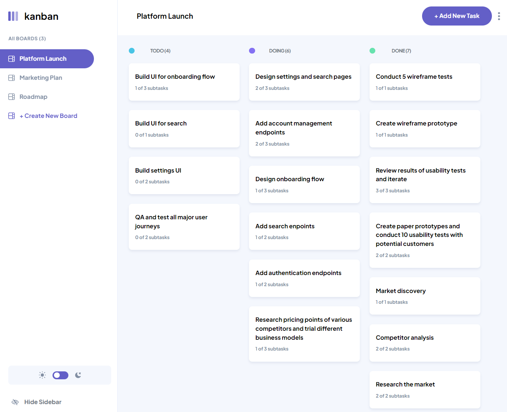

# Kanban

Built with

- Semantic HTML5 markup
- CSS
- Flexbox
- Javascript
- React
- Tailwind

## Live Demo

Explore the live demo of the Audiophile E-commerce website [here](https://ralfislask.github.io/Kanban/).

## Status

This project is marked as "Finished."

## Getting Started

To run the Kanban application on your local machine, follow these steps:

1. Download or clone the repository.
2. Install the necessary dependencies by running `npm install`.
3. Start the application using `npm start` (Create React App).

## App Description

The Kanban app lets you streamline your workflow, organize tasks, and collaborate seamlessly. Visualize your projects, enjoy Dark Mode, create boards, and manage tasks effortlessly, including subtasks. Edit and adapt tasks and boards with ease as your projects evolve. Simplify your project management with Kanban.

# Features

1. **Dark Mode**: Toggle dark or light mode.
2. **Boards**: Create and customize digital boards for organizing tasks.
3. **Tasks with Subtasks**: Break down tasks into subtasks for more granular control.
4. **Edit Tasks/Boards**: Easily modify and update tasks and boards as your projects evolve.

## Author

- Frontend Mentor - [@RalfiSlask](https://www.frontendmentor.io/profile/RalfiSlask)
- GitHub - [RalfiSlask](https://github.com/RalfiSlask)
